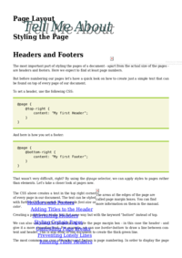
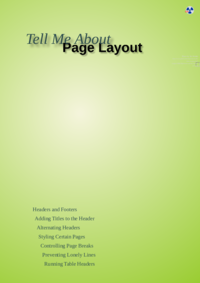

## Index

                            <a href="/compare.html2pdf.tools/PDFreactor-Examples/textbook/fonts/">
                                fonts
                            </a>

                            <a href="/compare.html2pdf.tools/PDFreactor-Examples/textbook/resources/">
                                resources
                            </a>

## 🔬 TEXTBOOK

### Input HTML & CSS

[📄 Input HTML](https://raw.githubusercontent.com/azettl/compare.html2pdf.tools/master//html/PDFreactor%20Examples/textbook/textbook.html)

    

        View TEXTBOOK Code
    

    <pre>
        <code>
            &lt;!DOCTYPE html&gt;
&lt;html lang=&quot;en-US&quot;&gt;
  &lt;head&gt;
  &lt;title&gt;Textbook&lt;/title&gt;
  &lt;style&gt;/*
    ===================================
         Load fonts from folder
    ===================================
    */
    @font-face {
        font-family: Gentium;
        src: url(&quot;fonts/Gentium/GenBasR.ttf&quot;);
    }
    @font-face {
        font-family: Gentium;
        font-weight: bold;
        src: url(&quot;fonts/Gentium/GenBasB.ttf&quot;);
    }
    @font-face {
        font-family: Gentium;
        font-style: italic;
        src: url(&quot;fonts/Gentium/GenBasI.ttf&quot;);
    }
    @font-face {
        font-family: Gentium;
        font-weight: bold;
        font-style: italic;
        src: url(&quot;fonts/Gentium/GenBasBI.ttf&quot;);
    }
    
    @font-face {
        font-family: Sans;
        src: url(&quot;fonts/OpenSans/OpenSans-Regular.ttf&quot;);
        font-weight: normal;
    }
    
    @font-face {
        font-family: Sans;
        src: url(&quot;fonts/OpenSans/OpenSans-Bold.ttf&quot;);
        font-weight: bold;
    }
    
    @font-face {
        font-family: Sans;
        src: url(&quot;fonts/OpenSans/OpenSans-Italic.ttf&quot;);
        font-weight: normal;
        font-style: italic;
    }
    
    @font-face {
        font-family: Sans;
        src: url(&quot;fonts/OpenSans/OpenSans-BoldItalic.ttf&quot;);
        font-weight: bold;
        font-style: italic;
    }
    
    /*
    ===================================
             Page Styles
    ===================================
    */
    
    /* Set up the the page styles that are the same for all pages */
    @page {
        @top-left {
            border-bottom: 15px solid yellowgreen;  /* The green line in the header */
        }
        @top-right {
            border-bottom: 15px solid yellowgreen;  /* The green line in the header */
        }
        
        size: A4;
        margin: 1.5cm;
        padding-top: 5mm;
    }
    
    /* The settings of the page named landscape */
    @page landscape {
        size: A4 landscape;     /* The page should be landscape and of the size A4 */
        
        /* Remove the header for this page */
        @top-left {
            border:none;
            content: &quot;&quot;;
            background: none;
        }
        @top-right {
            border:none;
            content: &quot;&quot;;
            background: none;
        }
        
        margin-left: 5mm;
        padding-left: 5mm;
        margin-right: 5mm;
        padding-right: 5mm;
    }
    
    @page landscape:right {
        margin-top: 2cm;
    }
    
    @page landscape:left {
        margin-bottom: 2cm;
    }
    
    /* Styles of the first page, aka the cover */
    @page:first {
        /* No page counter for first page */
        counter-increment: page 0;
        
        /* Remove the header */
        @top-left {
            border:none;
            content: &quot;&quot;;
            background: none;
        }
        @top-right {
            border:none;
            content: &quot;&quot;;
            background: none;
        }
        
        /* Set the gradient on the page background */
        background-image: radial-gradient(circle farthest-corner at 40% 40%, beige, yellowgreen);
        
        /* Remove the page margin as it is not needed and should not intervene the gradient */
        margin: 0;
    }
    
    /* Set the styles for all pages on the left */
    @page:left {
        
        /* Set up the styles of the page numbering */
        @top-left {
            padding-top: 6mm;
            padding-left: 2mm;
            content: counter(page);
            font-size: 20pt;
            font-family: Sans, sans-serif;
        }
        
        /* Set up the styles of the chapter titles */
        @top-right {
            content: string(chaptertitle) &quot; - &quot; string(subchaptertitle);
            font-family: Sans, sans-serif;
            font-style: italic;
            padding-top: 5mm;
            margin-right: 1cm;
        }
        
        /* Set the paddings on the sides */
        padding-right: 2cm;
        padding-left: 1.5cm;
    }
    
    /* Set the styles for all pages on the right */
    @page:right {
        
        /* Set up the styles of the page numbering */
        @top-right {
            padding-top: 6mm;
            padding-right: 2mm;
            content: counter(page);
            font-size: 20pt;
            font-family: Sans, sans-serif;
        }
        
        /* Set up the styles of the chapter titles */
        @top-left {
            content: string(chaptertitle) &quot; - &quot; string(subchaptertitle);
            font-family: Sans, sans-serif;
            font-style: italic;
            padding-top: 5mm;
            margin-left: 1cm;
        }
        
        
        /* Set the paddings on the sides */
        padding-right: 1.5cm;
        padding-left: 2cm;
        
    }
    
    @page:-ro-nth(1 of chapter) {
        @top-left-corner {
            content: none;
        }
        
        @top-left {
            content: none;
        }
    
        @top-right {
            content: none;
        }
    
        @top-right-corner {
            content: none;
        }
    }
    
    /* Set the styles for the last page */
    @page:-ro-last {
        
        margin-bottom: 10cm;
        
        @bottom-center {
            content: element(disclaimer);
            background-color: beige;
            border-top: 2cm solid yellowgreen;
            -ro-pdf-tag-type: &quot;Div&quot;;
        }
        
        @bottom-left-corner {
            content: &quot;&quot;;
            background-color: beige;
            border-top: 2cm solid yellowgreen;
        }
        
        @bottom-right-corner {
            content: &quot;&quot;;
            background-color: beige;
            border-top: 2cm solid yellowgreen;
        }
    }
    
    /* 
        Styles used by the cover
    */
    #coverList p {
        padding: 1mm 0mm 1mm 2mm;
        margin: 1mm;
        text-align: left;
        color: darkslategrey;
    }
    
    #coverList a {
        color: darkslategrey;
        text-decoration: none;
    }
    
    p.coverPage {
        text-shadow: 8pt 8pt 8pt rgba(0, 0, 0, 0.5);
    }
    
    /*
    ===================================
           Media Styles
    ===================================
    */
    
    /*
        When opened in a browser, some elements on the cover 
        page like the picture should be hidden.
    */
    @media screen {
        body &gt; h1 {
            padding-top: 1cm;
        }
        .coverPage, #coverList {
            display: none;
        }
    }
    
    /*
    ===================================
            Chapter Styles
    ===================================
    */
    body &gt; h1 {
        margin-top: 0;
        padding-top: 3.4cm;
        counter-increment: h1 1;
        counter-reset: h2 0;
        font-size: 40pt;
        font-family: Sans, sans-serif;
        line-height: 1.5;
        text-align: center;
        
        text-shadow: 4pt 4pt 3pt rgba(0, 0, 0, 0.3);
    }
    
    body &gt; section {
        page: chapter;
    }
    
    body &gt; section &gt; h1 {
        break-before: page;             /* The chapter should always start on a new page */
        counter-increment: h2 1;        /* Increment the chapter counter named h2 */
        counter-reset: h3 0 figures 0;  /* Reset counters named h3 and figures */
        string-set: chaptertitle self;  /* Set the current chapter title as string for the header */
        font-size: 3rem;
        margin-top: 2cm;
        margin-bottom: 2cm;
        font-style: italic;
        text-align: left;
        
        text-shadow: 0.05em 0.05em 2pt rgba(0, 0, 0, 0.5);
    }
    
    body &gt; section &gt; h1::before {
        content: counter(h2, upper-latin) &quot; &quot;; /* Add the chapter number */
        position: absolute;
        right: -1.5cm;
        top: -1.5cm;
        padding: 0;
        margin: 0;
        font-size: 3em;
        z-index: -1;
        color: white !important;
        background-color: yellowgreen;
        height: 6cm;
        width: 6cm;
        text-align: center;
        font-style: initial;
        align-content: center;
    }
    
    body &gt; section &gt; h1::after {
        content: &quot;&quot;;
        position: absolute;
        top: calc(4.5cm - 2pt);
        left: -1.5cm;
        right: -1.5cm;
        border-bottom: 2pt solid yellowgreen;
        z-index: -1;
    }
    
    body &gt; section &gt; section &gt; h1 {
        counter-increment: h3 1;  /* Increase the counter for numbering of the sub-chapters */
        string-set: subchaptertitle self;
        font-size: 16pt;
        padding-top: 0.2cm;
        clear: both;
    }
    
    body &gt; section &gt; section &gt; h1::before {
        content: counter(h2, upper-latin) &quot;.&quot; counter(h3) &quot; &quot;;  /* Add the Chapter and the Sub-Chapter numbers */
        padding-right: 2mm;
    }
    
    body &gt; section &gt; h1,
    body &gt; section &gt; section &gt; h1 {
        font-family: Sans, sans-serif;
    }
    
    body &gt; section &gt; h1::before,
    body &gt; section &gt; section &gt; h1::before {
        color: yellowgreen;
        text-shadow: none;
    }
    
    
    /*
    ===================================
                Boxes
    ===================================
    */
    
    /*
        The Important Box (e.g. Summary)
    */
    figure.important {
        border:2px solid yellowgreen;
        break-inside: avoid-page;
    }
    
    figure.important &gt; figcaption {
        background-color: yellowgreen;
        color: white;
        padding: 1mm 1mm 1mm 2mm;
        font-weight: bold;
        font-family: Sans, sans-serif;
        font-size: 14pt;
    }
    
    figure.important &gt; div {
        break-before: avoid-page;
        margin: 2mm;
    }
    
    /*
        The image box with caption
    */
    figure.image {
        break-inside: avoid-page;
        margin: 0mm 5mm 2mm 5mm;
        counter-increment: figures;
    }
    
    figure.image &gt; img {
        box-shadow: 1mm 1mm 1mm #00000088;
    }
    
    figure.image &gt; figcaption {
        padding: 2mm 1mm 2mm 3mm;
        font-family: Sans, sans-serif;
        font-size: 9pt;
        text-align: left;
    }
    
    figure.image &gt; figcaption::before {
        content: &quot;Fig. &quot; counter(h2, upper-latin) &quot;.&quot; counter(figures) &quot; &quot;; /* Add figure numbering */
        font-weight: bold;
    }
    /* Table captions */
    caption {
        font-family: Sans, sans-serif;
        font-size: 1rem;
        font-style: italic;
        text-align: left;
    }
    /* Floats used by the image boxes */
    .floatl {
        float:left;
        margin-left: 0 !important;
    }
    
    .floatr {
        float:right;
        margin-right: 0 !important;
    }
    
    /*
        Code Box
    */
    div.note {
        clear: both;
        background-color: beige;
        margin-top: 12pt;
        margin-bottom: 12pt;
        padding: 1mm 5mm 1mm 5mm;
        border-top: 4px solid yellowgreen;
        border-bottom: 4px solid yellowgreen;
        break-inside: avoid-page;
        break-before: avoid-page;
    }
    
    div.note strong {
        color: crimson;
    }
    
    /*
        Note Box
    */
    /* Note that the same class is used for two different elements. 
        The class styles depend on the element */
    p.note {  
        background-color: beige;
        margin-top: 5mm;
        position: relative;
        padding: 4mm;
        clear: both;
    }
    
    p.note::before {
        content: &quot;NOTE: &quot;;
        position: absolute;
        left: 1mm;
        top: -3mm;
        font-weight: bold;
        font-family: Sans, sans-serif;
    }
    
    /*
    ===================================
                Tables
    ===================================
    */
    
    table {
        clear: both; /* Make sure that there are no floats to the side of the table */
    }
    
    table.wide {
        page: landscape; /* Set the name of the page containing this table */
    }
    
    table td {
        padding: 2mm 4mm 2mm 4mm;
        vertical-align: top;
        break-inside: avoid-page; /* There should not be a page break inside a table cell */
    }
    
    /* Styles of table header cells */
    table th {
        padding: 1mm 2mm 1mm 2mm;
        text-align: inherit;
    }
    
    /* The other table styles */
    table.styled {
        border: 2px solid yellowgreen;
        margin: 2mm 0;
        border-collapse: collapse;
    }
    
    /* Style the table header row */
    table.styled thead {
        background-color: yellowgreen;
        color:white;
        font-family: Sans, sans-serif;
    }
    
    /* Have alternating colors for the rows */
    table.styled tr:nth-child(even) {
        background-color: beige;
    }
    
    table.styled td:first-child {
        white-space: nowrap;
    }
    
    /*
    ===================================
           Disclaimer
    ===================================
    */
    #disclaimer {
        position: running(disclaimer);
        font-size: 14pt;
        padding: 1cm 1cm;
    }
    
    #disclaimer li {
        list-style-image: url(resources/box.svg);
    }
    
    /*
    ===================================
           General Styles
    ===================================
    */
    html {
        font-family: Gentium;
        -ro-line-grid: create;
    }
    
    p {
        text-align: justify;
        hyphens: auto;
    }
    
    strong {
        color: green;
    }
    
    sup {
        font-size: 0.6em;
    }
    
    /*
    ===================================
                Preferences
    ===================================
    */
    @-ro-preferences {
        first-page-side: right;
        page-layout: 1 column;
        initial-zoom: fit-page;
    }
    &lt;/style&gt;
  &lt;/head&gt;
  &lt;body&gt;
    &lt;p class=&quot;coverPage&quot; style=&quot;font-size: 45pt; color: darkslategrey; font-style: italic; position: absolute; top: 1.55cm; left: 2.7cm; z-index: 1;&quot;&gt;Tell Me About&lt;/p&gt;
    &lt;h1 style=&quot;position:relative&quot;&gt;Page Layout&lt;/h1&gt;
    
    &lt;div id=&quot;coverList&quot; style=&quot;font-size:16pt; position: absolute; bottom: 1.5cm; left: 15%;&quot;&gt;
            &lt;p&gt;&lt;a href=&quot;#HeadersAndFooters&quot;&gt;Headers and Footers&lt;/a&gt;
            &lt;/p&gt;
            &lt;p style=&quot;padding-left: 4mm;&quot;&gt; &lt;a href=&quot;#AddingTitlesToTheHeader&quot;&gt;Adding Titles to the Header&lt;/a&gt;
            &lt;/p&gt;
            &lt;p style=&quot;padding-left: 6mm;&quot;&gt;&lt;a href=&quot;#AlternatingHeaders&quot;&gt;Alternating Headers&lt;/a&gt;
            &lt;/p&gt;
            &lt;p style=&quot;padding-left: 8mm;&quot;&gt;&lt;a href=&quot;#StylingCertainPages&quot;&gt;Styling Certain Pages&lt;/a&gt;
            &lt;/p&gt;
            &lt;p style=&quot;padding-left: 10mm;&quot;&gt;&lt;a href=&quot;#ControllingPageBreaks&quot;&gt;Controlling Page Breaks&lt;/a&gt;
            &lt;/p&gt;
            &lt;p style=&quot;padding-left: 12mm;&quot;&gt;&lt;a href=&quot;#PreventingLonelyLines&quot;&gt;Preventing Lonely Lines&lt;/a&gt;
            &lt;/p&gt;
            &lt;p style=&quot;padding-left: 14mm;&quot;&gt;&lt;a href=&quot;#RunningTableHeaders&quot;&gt;Running Table Headers&lt;/a&gt;
            &lt;/p&gt;
    &lt;/div&gt;
    
    &lt;div style=&quot;position: absolute; top:22%; right: 0&quot;&gt;
        &lt;img class=&quot;coverPage&quot; src=&quot;resources/water-drop-on-grass.jpg&quot; /&gt;
        &lt;div class=&quot;coverPage&quot; style=&quot;text-align:right; position: absolute; color: lightgrey; bottom: 0.3em; right: 2mm; font-size: 6pt;&quot;&gt;
            Photo by Jiri Hodan&lt;br/&gt;
            &lt;span style=&quot;font-size: 5pt&quot;&gt;http://www.publicdomainpictures.net/view-image.php?image=20681&amp;#38;picture=wassertropfen-auf-gras&lt;/span&gt;
        &lt;/div&gt;
    &lt;/div&gt;
    
    &lt;section&gt;
        &lt;h1&gt;Styling the Page&lt;/h1&gt;
        
        &lt;section&gt;
            &lt;h1 id=&quot;HeadersAndFooters&quot;&gt;Headers and Footers&lt;/h1&gt;
            
            &lt;p&gt;The most important part of styling the pages of a document - apart from the actual size
            of the pages - are headers and footers. Here we expect to find at least page numbers.&lt;/p&gt;
            &lt;p&gt;But before numbering our pages let's have a quick look on how to create just a simple
            text that can be found on top of every page of our document.&lt;/p&gt;
            &lt;p&gt;To set a header, use the following CSS:&lt;/p&gt;
            &lt;div class=&quot;note&quot;&gt;
                &lt;pre&gt;@page {
    @top-right {
        content: &quot;My first Header&quot;;
    }
}&lt;/pre&gt;
            &lt;/div&gt;
            &lt;p&gt;And here is how you set a footer:&lt;/p&gt;
            &lt;div class=&quot;note&quot;&gt;
                &lt;pre&gt;@page {
    @bottom-right {
        content: &quot;My first Footer&quot;;
    }
}&lt;/pre&gt;
            &lt;/div&gt;
            &lt;p&gt;That wasn't very difficult, right? By using the &lt;i&gt;@page&lt;/i&gt; selector, we can 
                apply styles to pages rather than elements. Let's take a closer look at pages now.&lt;/p&gt;
            
            &lt;figure class=&quot;floatr image&quot; style=&quot;width:225pt&quot;&gt;
                &lt;img src=&quot;resources/PageMargin.png&quot; width=&quot;100%&quot;/&gt;
                &lt;figcaption&gt;The areas at the edges of the page are called page margin boxes. You can find more 
                information on them in the manual.&lt;/figcaption&gt;
            &lt;/figure&gt;&lt;p&gt;The CSS above creates a text in the top right corner of every page in our 
                document. The text can be styled with further CSS properties, for example &lt;i&gt;font-size&lt;/i&gt; or 
                &lt;i&gt;color&lt;/i&gt;.&lt;/p&gt;
            &lt;p&gt;Creating a page footer works just the same way but with the keyword &quot;&lt;i&gt;bottom&lt;/i&gt;&quot; instead of top.&lt;/p&gt;
            &lt;p&gt;We can also use other CSS properties to style the page margin box - in this case the header - and give it
            a more appealing look. For example, we can use &lt;i&gt;border-bottom&lt;/i&gt; to draw a line between content and header.
            This is also done in this document to create the thick green line.&lt;/p&gt;
            &lt;p&gt;The most common use case of headers and footers is page numbering. In order to
            display the page numbers we use &lt;strong&gt;counters&lt;/strong&gt;.&lt;/p&gt;
            &lt;figure class=&quot;floatr image&quot; style=&quot;width:225pt&quot;&gt;
                &lt;img src=&quot;resources/PageCounter.png&quot; width=&quot;100%&quot;/&gt;
                &lt;figcaption&gt;Page numbers are created with counters.&lt;/figcaption&gt;
            &lt;/figure&gt;
            &lt;p&gt;First, we have to tell our counter what to count. Since we just want to count pages we can use the 
                pre-defined counter &quot;page&quot;.&lt;/p&gt;
            &lt;p&gt;Now that our counter has a name and knows what to count, we can access it in the header:&lt;/p&gt;
            &lt;div class=&quot;note&quot;&gt;
                &lt;pre&gt;@page {
    @top-right: {
        content: &quot;My first Header - Page &quot; &lt;strong&gt;counter(page)&lt;/strong&gt;;
    }
}&lt;/pre&gt;
            &lt;/div&gt;
            &lt;p&gt;The keyword &lt;i&gt;counter&lt;/i&gt; signals that this &quot;text&quot; is to be replaced with the current
                value of the counter named in the brackets.&lt;/p&gt;
            &lt;p&gt;Would you like to know more about the capabilities of counters? Maybe how to use them in headings?
                You can find more information in the PDFreactor manual.&lt;/p&gt;
        &lt;/section&gt;

        &lt;section&gt;
            &lt;h1 id=&quot;AddingTitlesToTheHeader&quot;&gt;Adding Titles to the Header&lt;/h1&gt;
            
            &lt;p&gt;Dynamic headers will always look better than static ones. In the previous chapter we saw that the content of headers can be 
            replaced with the current value of variables. This does not only work with numbers but also with text (aka strings).&lt;/p&gt;
            &lt;p&gt;Just like with the page counter, the value that should be shown on the page must first be set via CSS selectors:&lt;/p&gt;
                &lt;div class=&quot;note&quot;&gt;
            &lt;pre&gt;h1 {
    &lt;strong&gt;string-set: chaptertitle self;&lt;/strong&gt;
}&lt;/pre&gt;
            &lt;/div&gt;
            &lt;p&gt;And as with the counters the first value is the name of the variable, the second one is what should be set. 
            In this case the keyword &lt;i&gt;self&lt;/i&gt; is used to indicate that the text of the selected element - here the h1 - should be used.&lt;/p&gt;
            &lt;p&gt;Accessing this variable is just as easy as with page numbering you only need to change the keyword &lt;i&gt;counter&lt;/i&gt; to &lt;i&gt;string&lt;/i&gt;:&lt;/p&gt;
            &lt;div class=&quot;note&quot;&gt;
                &lt;pre&gt;@page {
    @top-left: {
        content: &quot;Chapter &quot; &lt;strong&gt;string(chaptertitle)&lt;/strong&gt;;
    }
}&lt;/pre&gt;
            &lt;/div&gt;
            &lt;p&gt;With this CSS rule, we now have a short text and the title of the last heading at the top left corner of each page.&lt;/p&gt;
        &lt;/section&gt;

        &lt;section&gt;
            &lt;h1 id=&quot;AlternatingHeaders&quot;&gt;Alternating Headers&lt;/h1&gt;
            
            &lt;figure class=&quot;floatr image&quot; style=&quot;width: 225pt&quot;&gt;
                &lt;img src=&quot;resources/BookLayout.png&quot; width=&quot;100%&quot;/&gt;
                &lt;figcaption&gt;Layout features of a book&lt;/figcaption&gt;
            &lt;/figure&gt;
            &lt;p&gt;If you want to print and bind a document with headers and footers you often need
            different headers for even and odd pages, as the page number should always be on the 
            outer edge of the pages.
            &lt;/p&gt;
            &lt;p&gt;Basically, you need to define two different headers for these cases. One for all pages on the right side
            and one for all pages on the left side of the book. Luckily there is a CSS selector for this:&lt;/p&gt;
            &lt;div class=&quot;note&quot;&gt;
                &lt;pre&gt;@page&lt;strong&gt;:right&lt;/strong&gt; {
    @top-left: {
        content: &quot;Chapter &quot; string(chaptertitle);
    }
    @top-right: {
        content: &quot;Page &quot; counter(page);
    }
}&lt;/pre&gt;
            &lt;/div&gt;
            &lt;p&gt;The so called &lt;strong&gt;pseudo selector&lt;/strong&gt; &quot;:right&quot; limits the rules that follow to pages on the right. Of course
            the same can be done with &quot;:left&quot; for the pages on the other side.&lt;/p&gt;
        &lt;/section&gt;

        &lt;section&gt;
            &lt;h1 id=&quot;StylingCertainPages&quot;&gt;Styling Certain Pages&lt;/h1&gt;
            
            &lt;p&gt;As we have seen in the previous chapter, we have different styles for pages on the right and the left. But 
            we can also select one specific page in order to style it. A common use case is the very first page
            of document, the cover. You don't want the header with page numbering on this page.&lt;/p&gt;
            &lt;p&gt;Selecting the first page is also the simplest case. Just use the pseudo selector &quot;:first&quot;.
            With this page selected you can suppress the styles of the header that has been set in the 
            previous chapters:&lt;/p&gt;
            &lt;div class=&quot;note&quot;&gt;
                &lt;pre&gt;@page&lt;strong&gt;:first&lt;/strong&gt; {
    @top-left: {
        content: none;
    }
    @top-right: {
        content: none;
    }
}&lt;/pre&gt;
            &lt;/div&gt;
            &lt;p&gt;In addition to the first page you can also style the last page of the document. A common use case for this is 
                if you want to add a disclaimer to the end of the document. The disclaimer would replace the normal footer while 
                also being much bigger. To select the last page use the selector &quot;:-ro-last&quot;.&lt;/p&gt;
            &lt;div class=&quot;note&quot;&gt;
                    &lt;pre&gt;@page:-ro-last {
    margin-bottom: 6cm;
    
    @bottom-left {
        content: &quot;This is the disclaimer text.&quot;;
    }
}&lt;/pre&gt;
                &lt;/div&gt;
            &lt;p&gt;But what if you want to select a certain page somewhere in the middle of your document? For this case you have two options:
                You can select the &lt;strong&gt;n&lt;sup&gt;th&lt;/sup&gt; page&lt;/strong&gt; (e.g. the second page) or you can use 
                &lt;strong&gt;named pages&lt;/strong&gt;. You can give the page a name and then select it via CSS.&lt;/p&gt;
            &lt;p&gt;Selecting a certain page number is quite straight forward using the &quot;:-ro-nth&quot; selector with the page number:&lt;/p&gt;
            &lt;div class=&quot;note&quot;&gt;
                &lt;pre&gt;page:-ro-nth(&lt;strong&gt;2&lt;/strong&gt;) {
    size: A4 landscape;
}&lt;/pre&gt;
            &lt;/div&gt;
            &lt;p&gt;Naming a page is done by its content. The naming element causes a page break
            and gives its page the defined name:&lt;/p&gt;
            &lt;div class=&quot;note&quot;&gt;
                &lt;pre&gt;table.wide {
    &lt;strong&gt;page: landscape&lt;/strong&gt;;
}&lt;/pre&gt;
            &lt;/div&gt;
            &lt;p&gt;In this case &quot;landscape&quot; is the name the page with this table is going to have.&lt;/p&gt;
            &lt;div class=&quot;note&quot;&gt;
                &lt;pre&gt;@page &lt;strong&gt;landscape&lt;/strong&gt; {
    size: A4 landscape;
}&lt;/pre&gt;
            &lt;/div&gt;
            &lt;p&gt;What we have now is that all tables of the class &quot;wide&quot; are now on pages that have 
            been rotated by 90 degrees so that our wide table has much more room to the sides.&lt;/p&gt;

            &lt;p&gt;Another common use case are special page styles for the beginning of chapters. Maybe you do not want to display 
                headers and footers on such pages or you want different margins. In this case, you can use &lt;strong&gt;page groups&lt;/strong&gt;. 
                To define page groups, surround each chapter with a container element and place these containers on named pages. 
                Each container represents a page group and you can select an arbitrary page of each group using the 
                &quot;:-ro-nth(n of chapter)&quot; selector.&lt;/p&gt;
            &lt;p&gt;The following example removes the header on the first page of each chapter:&lt;/p&gt;
            &lt;div class=&quot;note&quot;&gt;
                &lt;pre&gt;section {
    page: chapter;
}

@page:-ro-nth(&lt;strong&gt;1 of chapter&lt;/strong&gt;) {
    @top-left {
        content: none;
    }
}
                &lt;/pre&gt;
            &lt;/div&gt;
            &lt;p&gt;&lt;strong&gt;Important:&lt;/strong&gt; For page groups to work, the container elements for each chapter must be separated 
                by a forced page break.&lt;/p&gt;

            &lt;p&gt;The following table gives you an overview over some selectors and their use cases.&lt;/p&gt;
            &lt;p class=&quot;note&quot;&gt;You can find more information on how to select page margin boxes in the PDFreactor manual.&lt;/p&gt;
            &lt;table class=&quot;wide styled&quot;&gt;
                &lt;caption&gt;Selectors for pages and page margin boxes&lt;/caption&gt;
                &lt;thead&gt;
                    &lt;tr&gt;
                        &lt;th&gt;Selector
                        &lt;/th&gt;
                        &lt;th&gt;What is Selected
                        &lt;/th&gt;
                        &lt;th&gt;Common Use Cases
                        &lt;/th&gt;
                    &lt;/tr&gt;
                &lt;/thead&gt;
                &lt;tbody&gt;
                    &lt;tr&gt;
                        &lt;td&gt;@page
                        &lt;/td&gt;
                        &lt;td&gt;All pages of the document (not their content)
                        &lt;/td&gt;
                        &lt;td&gt;Setting the page size, setting up a page counter,
                            setting styles like a border on the top.
                        &lt;/td&gt;
                    &lt;/tr&gt;
                    &lt;tr&gt;
                        &lt;td&gt;@page:first
                        &lt;/td&gt;
                        &lt;td&gt;The very first page of the document
                        &lt;/td&gt;
                        &lt;td&gt;Disabling styles for the cover page,
                            setting specific styles for the first page, e.g. background-color
                        &lt;/td&gt;
                    &lt;/tr&gt;
                    &lt;tr&gt;
                        &lt;td&gt;@page:-ro-last
                        &lt;/td&gt;
                        &lt;td&gt;The very last page of the document
                        &lt;/td&gt;
                        &lt;td&gt;Adding a disclaimer to the end of the document
                        &lt;/td&gt;
                    &lt;/tr&gt;
                    &lt;tr&gt;
                        &lt;td&gt;@page:right/:left
                        &lt;/td&gt;
                        &lt;td&gt;Selecting all pages on the right/left
                        &lt;/td&gt;
                        &lt;td&gt;Swapping the side of the page numbering depending on the page (for printing and binding books)
                        &lt;/td&gt;
                    &lt;/tr&gt;
                    &lt;tr&gt;
                        &lt;td&gt;@page:-ro-nth(n)
                        &lt;/td&gt;
                        &lt;td&gt;The n&lt;sup&gt;th&lt;/sup&gt; page of the document
                        &lt;/td&gt;
                        &lt;td&gt;Applying special styles to arbitrary pages, e.g. for a preface in a book.
                        &lt;/td&gt;
                    &lt;/tr&gt;
                    &lt;tr&gt;
                        &lt;td&gt;@page name
                        &lt;/td&gt;
                        &lt;td&gt;Select all pages containing elements with the CSS property &quot;page: name&quot;
                        &lt;/td&gt;
                        &lt;td&gt;Rotating a certain page to landscape so a wide table or image may fit,
                            suppressing page header and styling a certain page with background-images
                        &lt;/td&gt;
                    &lt;/tr&gt;
                    &lt;tr&gt;
                        &lt;td&gt;@page:-ro-nth(n of name)
                        &lt;/td&gt;
                        &lt;td&gt;Select the n&lt;sup&gt;th&lt;/sup&gt; page of each page group with the given name.
                        &lt;/td&gt;
                        &lt;td&gt;Applying special styles to repeating structires, e.g. the first page of each chapter in a book.
                        &lt;/td&gt;
                    &lt;/tr&gt;
                    &lt;tr&gt;
                        &lt;td&gt;@page {&lt;br/&gt; 
                        &amp;nbsp;&amp;nbsp;@top-left/&lt;br/&gt;
                        &amp;nbsp;&amp;nbsp;@top-center/&lt;br/&gt;
                        &amp;nbsp;&amp;nbsp;@top-right&lt;br/&gt;
                        &lt;/td&gt;
                        &lt;td&gt;Select the margin box on the top left/center/right of the page
                        &lt;/td&gt;
                        &lt;td&gt;Styling the box, adding content like page numbering
                        &lt;/td&gt;
                    &lt;/tr&gt;
                    &lt;tr&gt;
                        &lt;td&gt;@page {&lt;br/&gt; 
                        &amp;nbsp;&amp;nbsp;@right-top/&lt;br/&gt;
                        &amp;nbsp;&amp;nbsp;@right-middle/&lt;br/&gt;
                        &amp;nbsp;&amp;nbsp;@right-bottom&lt;br/&gt;
                        &lt;/td&gt;
                        &lt;td&gt;Select the margin boxes on the right of the page
                        &lt;/td&gt;
                        &lt;td&gt;Styling the header on a landscape page (e.g. using a border. Note 
                        that text can not be rotated alone)
                        &lt;/td&gt;
                    &lt;/tr&gt;
                &lt;/tbody&gt;
            &lt;/table&gt;
        &lt;/section&gt;
    &lt;/section&gt;
    
    &lt;section&gt;
        &lt;h1&gt;Page Breaks&lt;/h1&gt;
        &lt;section&gt;
            &lt;h1 id=&quot;ControllingPageBreaks&quot;&gt;Controlling Page Breaks&lt;/h1&gt; 
            
            &lt;p&gt;You may have noticed, that on the previous page the table stood alone although there was more than enough space for more
            content. However, using CSS a page break was enforced.&lt;/p&gt;
            &lt;p&gt;Enforcing a page break is done with the CSS properties &lt;i&gt;break-before&lt;/i&gt; and &lt;i&gt;break-after&lt;/i&gt;. In this document 
            for example every chapter begins on its own page.&lt;/p&gt;
            &lt;div class=&quot;note&quot;&gt;
            &lt;pre&gt;h1 {
    &lt;strong&gt;break-before: page&lt;/strong&gt;;
}&lt;/pre&gt;
            &lt;/div&gt;
            &lt;figure class=&quot;floatr image&quot; style=&quot;width: 187.5pt;&quot;&gt;
                &lt;img src=&quot;resources/WrongPageBreak.png&quot; width=&quot;80%&quot;/&gt;
                &lt;figcaption&gt;That's not how it is done.&lt;/figcaption&gt;
            &lt;/figure&gt;
            &lt;p&gt;On the other hand there are cases where you don't want a page break to occur, for example inside a table or code box.
            In these cases the property &lt;i&gt;break-inside&lt;/i&gt; is used.&lt;/p&gt;
            &lt;p&gt;All these properties can be set to &lt;i&gt;page&lt;/i&gt;, &lt;i&gt;avoid-page&lt;/i&gt; and &lt;i&gt;auto&lt;/i&gt;, the default value. For more information on page breaks,
            check out the PDFreactor manual.&lt;/p&gt;
            &lt;p class=&quot;note&quot;&gt;Images are never split and put on different pages. PDFreactor will always try to have the complete
            image on one single page.&lt;/p&gt;
            &lt;table class=&quot;styled&quot;&gt;
                &lt;caption&gt;Break properties&lt;/caption&gt;
                &lt;thead&gt;
                    &lt;tr&gt;
                        &lt;th&gt;Property&lt;/th&gt;
                        &lt;th&gt;What it does&lt;/th&gt;
                        &lt;th&gt;Use Cases&lt;/th&gt;
                    &lt;/tr&gt;
                &lt;/thead&gt;
                &lt;tbody&gt;
                    &lt;tr&gt;
                        &lt;td&gt;break-before:page&lt;/td&gt;
                        &lt;td&gt;The element is always on a new page&lt;/td&gt;
                        &lt;td&gt;Title of new chapter, element on landscape page, big elements e.g. images&lt;/td&gt;
                    &lt;/tr&gt;
                    &lt;tr&gt;
                        &lt;td&gt;break-before:avoid-page&lt;/td&gt;
                        &lt;td&gt;The element is not on the top of a new page (if avoidable)&lt;/td&gt;
                        &lt;td&gt;Table with a short description right above it&lt;/td&gt;
                    &lt;/tr&gt;
                    &lt;tr&gt;
                        &lt;td&gt;break-after:page&lt;/td&gt;
                        &lt;td&gt;The following element is always on a new page&lt;/td&gt;
                        &lt;td&gt;element (e.g. big table) on landscape page&lt;/td&gt;
                    &lt;/tr&gt;
                    &lt;tr&gt;
                        &lt;td&gt;break-after:avoid-page&lt;/td&gt;
                        &lt;td&gt;If a page break would occur after this element, it is put on the next page instead.&lt;/td&gt;
                        &lt;td&gt;Two elements belonging together like a image and a description.&lt;/td&gt;
                    &lt;/tr&gt;
                    &lt;tr&gt;
                        &lt;td&gt;break-inside:avoid-page&lt;/td&gt;
                        &lt;td&gt;If a page break would occur inside this element, put it on the next page instead.&lt;/td&gt;
                        &lt;td&gt;table that should not have a page break, a code box, table cells&lt;/td&gt;
                    &lt;/tr&gt;
                &lt;/tbody&gt;
            &lt;/table&gt;
        &lt;/section&gt;
        
        &lt;section&gt;
            &lt;h1 id=&quot;PreventingLonelyLines&quot;&gt;Preventing Lonely Lines&lt;/h1&gt;
            
            &lt;p&gt;There can be situations where the line of a paragraph does not fit on a page anymore and it
            is moved onto the next page - all alone. Poor little line. Fortunately this can be prevented.&lt;/p&gt;
            &lt;figure class=&quot;floatr image&quot; style=&quot;width: 225pt;&quot;&gt;
                &lt;img src=&quot;resources/orphan.png&quot; width=&quot;100%&quot;/&gt;
                &lt;figcaption&gt;The single line is an orphan.&lt;/figcaption&gt;
            &lt;/figure&gt;
            &lt;p&gt;If a lonely line is on the next page it is called
            a widow. If all other lines are on the next page, the line that has been left behind is referred to as an orphan.&lt;/p&gt;
            &lt;p&gt;Setting the minimum number of lines that may be alone on a page is done with CSS. The following CSS shows the 
            default settings of PDFreactor for orphans and widows:&lt;/p&gt;
                &lt;div class=&quot;note&quot;&gt;
                &lt;pre&gt;p {
    orphans: 2;
    widows: 2;
}&lt;/pre&gt;
            &lt;/div&gt;
            &lt;figure class=&quot;floatr image&quot; style=&quot;width: 225pt;&quot;&gt;
                &lt;img src=&quot;resources/noOrphan.png&quot; width=&quot;100%&quot;/&gt;
                &lt;figcaption&gt;The orphan has been moved to the other lines of the paragraph.&lt;/figcaption&gt;
            &lt;/figure&gt;
            &lt;p&gt;Changing the value to one will allow orphans and widows. Changing it to higher values will
                prevent even multiple line widows and orphans.&lt;/p&gt;
        &lt;/section&gt;
        &lt;section&gt;
            &lt;h1 id=&quot;RunningTableHeaders&quot;&gt;Running Table Headers&lt;/h1&gt;
            
            &lt;p&gt;Whenever a page break occurs within a table, running headers come in handy. On each page the table header is repeated
            at the top.&lt;/p&gt;
            &lt;p&gt;In order to use running headers, all you have to do is using the following HTML structure when creating the table:&lt;/p&gt;
            &lt;div class=&quot;note&quot;&gt;
                &lt;pre&gt;&amp;lt;table&amp;gt;
    &lt;strong&gt;&amp;lt;thead&amp;gt;
        &amp;lt;tr&amp;gt;
            &amp;lt;th&amp;gt;
            &amp;lt;/th&amp;gt;
        &amp;lt;/tr&amp;gt;
    &amp;lt;/thead&amp;gt;&lt;/strong&gt;
    &amp;lt;tbody&amp;gt;
        &amp;lt;tr&amp;gt;
            &amp;lt;td&amp;gt;
            &amp;lt;/td&amp;gt;
        &amp;lt;/tr&amp;gt;
    &amp;lt;/tbody&amp;gt;
&amp;lt;/table&amp;gt;&lt;/pre&gt;
            &lt;/div&gt;
            &lt;p&gt;This table would have only one column. For more columns just add more th/td elements.
            Also note that for every column in the table body there must be at least an empty cell in the table head.&lt;/p&gt;
        &lt;/section&gt;
    &lt;/section&gt;
    &lt;footer id=&quot;disclaimer&quot;&gt;
        &lt;div&gt;
            &lt;p&gt;What we have learned in this document:&lt;/p&gt;
            &lt;ul&gt;
                &lt;li&gt;Adding headers and footers with page numbers&lt;/li&gt;
                &lt;li&gt;Styling certain pages&lt;/li&gt;
                &lt;li&gt;Using CSS to properly make page breaks&lt;/li&gt;
                &lt;li&gt;Avoiding lonely lines&lt;/li&gt;
                &lt;li&gt;Creating a table with running headers&lt;/li&gt;
            &lt;/ul&gt;
            &lt;p&gt;You can find more information on these topics in the PDFreactor Manual.&lt;/p&gt;
        &lt;/div&gt;
    &lt;/footer&gt;
  &lt;/body&gt;
&lt;/html&gt;

        </code>
    </pre>

### Output PDF

| mPDF | typeset.sh | PDFreactor |
|---------|---------|---------|
|  |  |  |
| [📕 mPDF Output](mpdf__html_PDFreactor_Examples_textbook_textbook.html.pdf) | [📕 typeset Output](typeset__html_PDFreactor_Examples_textbook_textbook.html.pdf) | [📕 PDFreactor Output](pdfreactor__html_PDFreactor_Examples_textbook_textbook.html.pdf) |

